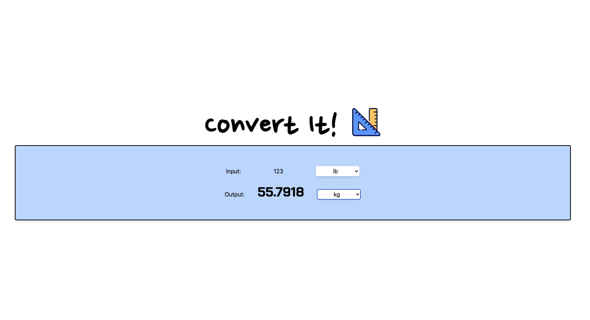

# unit-conversion

Small project to get myself familiar with the newest Vue.js stack with Vue3 composition API, Pinia store, and Vite

Converts units so I don't have to google every time >:(

Supports units of weights. I'm considering adding temperature and length as well :)

